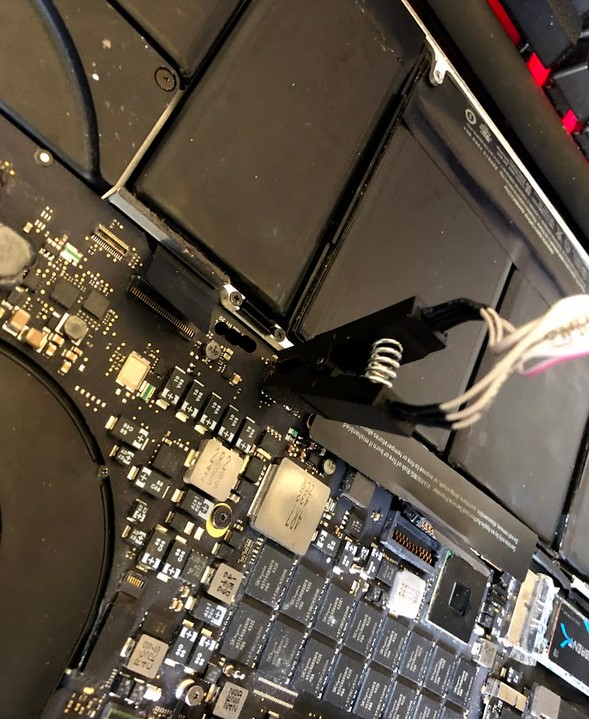

# Undervolt Patch for MacBooks

**Disclaimer: This tutorial requires some knowledge about disassembling laptops and using EEPROM programmers. Always make sure you have a backup of your original Firmware ROM. If the firmware gets corrupted, you won't be able to use your computer at all until you flash a proper ROM.**

Full explanation about how this mod works will be available soon at my [site](https://ismaelhg.github.io/Undervolt-Apple/)

This tutorial is currently only for Haswell based macs (2013-2014). Macs with Broadwell CPUs (2015) are already unlocked. Support for Skylake/Kaby Lake models (2016-2017) is expected on the future.

Once you follow the steps, you should be able to write on "MSR 0x150" which basically means you can do Undervolting with VoltageShift/Volta/ThrottleStop on your Mac.

You should only use this tutorial if you get an "OC_Locked" message on VoltageShift or "FIVR Control - locked" on ThrottleStop

1. Dump the firmware from your mac: You can do this by using the flashrom tool on a live usb with a Linux distribution (like Ubuntu) or directly with an external programmer like the CH341A using an SOP8 Clip (only for 15" 2013-2015 models) / JTAG adapter or desoldering the Firmware Chip. Check issue [#1](../../issues/1) about how to connect the programmer
2. When you're done, you should have an 8MB (8.388.608 bytes) file. Make sure you have a backup of this unmodified file
3. Download [UEFIPatch](https://github.com/LongSoft/UEFITool/releases/tag/0.28.0) , it's available for both Windows and Mac
4. Extract the zip and open the extracted folder. You'll see an "patched.txt" file.
5. Replace this file with the [patches.txt](patches.txt) file I uploaded on this repository 

6. Copy the ROM file from step 1 into the folder
7. Open a terminal, cd to the extracted folder, type the command "UEFIPatch.exe firmware.bin" or "UEFIPatch firmware.bin" on macOS. Don't worry about any "Unknown file system" warnings, if it says "Image Patched" you're ready to go.                                                             
    
8. Now you should see a new file "firmware.bin.patched" on your folder with same size as the old file (8.388.608 bytes).
9. Flash this patched firmware with an external programmer and your done. For my model, I used an CH341A connected with an SOP8 Clip
  
  

As you can see, I'm now able to undervolt with my 2014 15" MBP while using the latest Big Sur 11.3 Update which includes the 431.0.0.0.0 firmware.

## This tutorial was tested on the following MacBooks:
* Mid 2014 MacBook Pro 15" | Haswell
* Late 2013 MacBook Pro 15" | Haswell (tested by binh-geomatics)

## UPDATES
* 28/04/2021 - First Release
