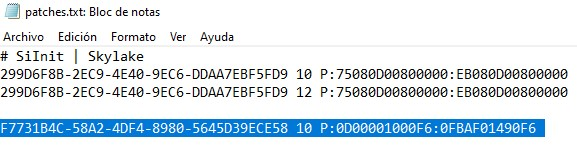
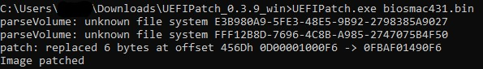
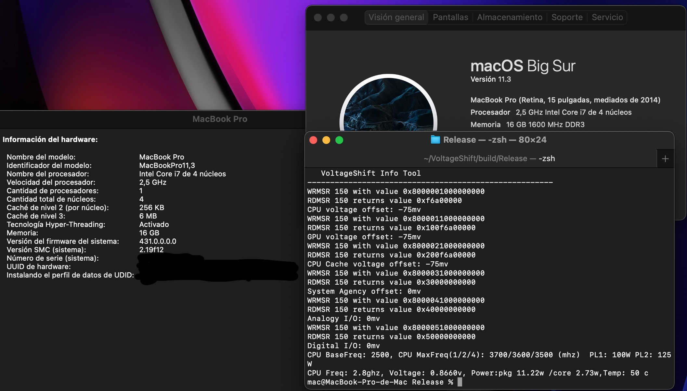

# UndervoltPatchMacBook

Disclaimer: This tutorial requires some knowledge about disassembling laptops and using EEPROM programmers. Always make sure you have a backup of your original Firmware ROM. If the firmware gets corrupted, you won't be able to use your computer at all until you flash a proper ROM.

This tutorial is currently only for Haswell based macs (2013-2014). Macs with Broadwell CPUs (2015) are already unlocked . Support for Skylake/Kaby Lake macs (2016-2017) is expected on the future

Once you follow the steps, you should be able to write on "MSR 0x150" which basically means you can do Undervolting with VoltageShift/Volta/ThrottleStop on your Mac.

You should only use this tutorial if you get an "OC_Locked" message on VoltageShift or "FIVR Control - locked" on ThrottleStop

These steps are tested with an MacBookPro Mid 2014 15" using the 431.0.0.0.0 firmware

1. Dump the firmware from your mac. You can do this by using the flashrom tool on a live usb with a Linux distribution (like Ubuntu) or directly with an external programmer like the CH341A using an SOP8 Clip (only for 15" 2013-2014 models) / JTAG or desoldering the Firmware Chip.
2. When you're done, you should have an 8MB (8.388.608 bytes) file. Make sure you have a backup of this unmodified file
3. Download [UEFIPatch](https://github.com/LongSoft/UEFITool/releases/tag/0.21.5) , it's available for both Windows and Mac
4. Extract the zip and open the extracted folder. You'll see an "patched.txt" file, open it.
5. Add this last line on the file without the quotes: "F7731B4C-58A2-4DF4-8980-5645D39ECE58 10 P:0D00001000F6:0FBAF01490F6 " (make sure to include the space character). You can also replace this file with the [patches.txt](patches.txt) file I uploaded on this repository 
6. 
7. Copy the ROM file from step1 into the folder
8. Open a terminal, cd to the extracted folder, type the command "UEFIPatch.exe firmware.bin" or "UEFIPatch firmware.bin" on mac. Don't worry about any "Unknown file system" warning, if it says "Image Patched" you're ready to go. 
9. 
10. Now you should see a new file "firmware.bin.patched" on your folder with same size as the old file (8.388.608 bytes).
11. Flash this patched firmware with an external programmer and your done

As you can see, I'm now able to undervolt with my 2014 15" MBP while usign the latest Big Sur 11.3 Update which includes the 431.0.0.0.0 firmware.

